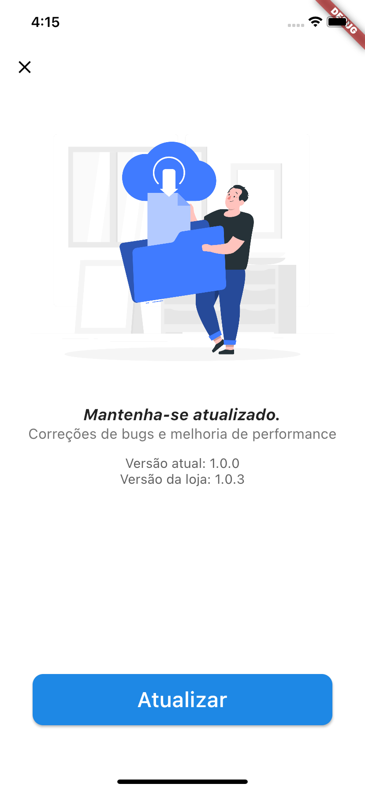
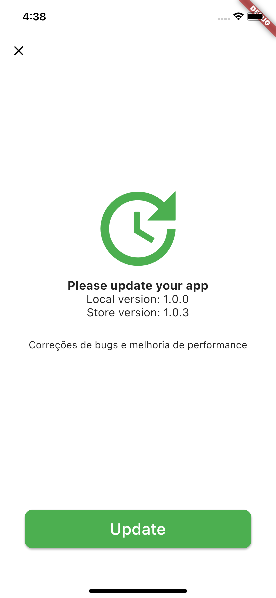

# show_update_dialog

Este pacote tem como intuito ajudar a manter aplicativos Android e IOS atualizados, permitindo com que você configure e avise automaticamente seus usuários sobre atualizações.
Basta inserir o bundleID da appleStore e  androidId que o package faz comunicação direta comparando a versão da loja com a local. 

[](readme_resources/sc01.png.png)[](readme_resources/sc02.png.png)

## Referências 

Existe varias propriedades para customizar, aqui está uma ficha rápida:
Propriedade | Disponível em | O que faz
-------- |-------- | ---------------
iOSId    | ShowUpdateDialog  | bundleID da appstore, responsavel por buscar versão e notas da loja.
androidId    | ShowUpdateDialog  | androidID playstore, responsavel por buscar a versão e notas na playStore.
iOSAppStoreCountry    | ShowUpdateDialog  | atenção você precisa definir esse parametro se seu app estiver publicado fora dos EUA. Basta informar a sigla do pais ex: 'BR', consulte em:  [Consulte sigla aqui](https://en.wikipedia.org/wiki/ISO_3166-1_alpha-2).
title    | showCustomDialogUpdate  | É usado para mudar o titulo padrão do aviso da atualização.
buttonColor    | showCustomDialogUpdate  | Pode passar uma cor para o botão de atulização ex: `Colors.blue`
buttonText    | showCustomDialogUpdate  | É utilizado para alterar o  texto do botão de atualização.
forceUpdate    | ShowUpdateDialog, showCustomDialogUpdate  | Marcar `true` para esconder botão e impedir usuário de fechar a janela de atualização, forçando assim o usuário a atualizar o aplicativo. 
bodyoverride    | showCustomDialogUpdate  | Sobrescreve todo o body do showCustomDialogUpdate, você pode passar um widget completo. 


### Para começar


Está é a forma de implementação mais simples, basta colocar no seu initState. o basico para iniciar é saber se você quer obrigar o usuário a atualizar, se sim você precisar marcar true em `forceUpdate`, tambem é preciso saber se seu app está publicado apenas fora dos EUA, se sim você precisa definir a propriedade `iOSAppStoreCountry`.


### Implementação simples

Está é a forma de implementação mais simples, basta colocar no seu initState.
```dart
  @override
  void initState() {
    final versionCheck = ShowUpdateDialog(
        iOSId: 'br.com.sbsistemas.simplescteapp',
        androidId: 'br.com.sbsistemas.simplescteapp',
        iOSAppStoreCountry: 'BR');

    versionCheck.showSimplesDialog(context);
  }
```


### Implementação com custumização da tela

Está é uma das formas de alterar a tela de atualização. 
```dart
verifyVersion() async {
    final versionCheck = ShowUpdateDialog(
        iOSId: 'br.com.sbsistemas.simplescteapp',
        androidId: 'br.com.sbsistemas.simplescteapp',
        iOSAppStoreCountry: 'BR');

    final VersionModel vs = await versionCheck.fetchVersionInfo();
    versionCheck.showCustomDialogUpdate(
      context: context,
      versionStatus: vs,
      buttonColor: Colors.black,
      buttonText: "Update :D",
      title: "Estamos mais novos do que nunca!",
      forceUpdate: true,
    );
  }
```

### Implementação com widget customizado

Implementando destá forma você pode refazer a tela da forma que preferir basta passar um Widget. 
```dart
  verifyVersion() async {
    final versionCheck = ShowUpdateDialog(
        iOSId: 'br.com.sbsistemas.simplescteapp',
        androidId: 'br.com.sbsistemas.simplescteapp',
        iOSAppStoreCountry: 'BR');

    final VersionModel vs = await versionCheck.fetchVersionInfo();

    versionCheck.showCustomDialogUpdate(
      context: context,
      versionStatus: vs,
      buttonText: "Update",
      buttonColor: Colors.green,
      bodyoverride: Column(
        mainAxisAlignment: MainAxisAlignment.center,
        children: [
          Row(
            mainAxisAlignment: MainAxisAlignment.center,
            children: [
              Icon(
                Icons.update,
                size: 150,
                color: Colors.green,
              ),
            ],
          ),
          Text(
            "Please update your app",
            style: TextStyle(fontWeight: FontWeight.w700, fontSize: 18),
          ),
          Text(
            "Local version: ${vs.localVersion}",
            style: TextStyle(fontSize: 17),
          ),
          Text(
            "Store version: ${vs.storeVersion}",
            style: TextStyle(fontSize: 17),
          ),
          SizedBox(height: 30),
          Text(
            "${vs.releaseNotes}",
            style: TextStyle(fontSize: 15),
          ),
        ],
      ),
    );
  }
  }
```


### Exemplo completo


```dart
import 'package:flutter/material.dart';
import 'package:show_update_dialog/main.dart';

class MyHomePage extends StatefulWidget {
  MyHomePage({Key? key, this.title = ''}) : super(key: key);

  final String title;

  @override
  _MyHomePageState createState() => _MyHomePageState();
}

class _MyHomePageState extends State<MyHomePage> {
  int _counter = 0;

  void _incrementCounter() {
    setState(() {
      _counter++;
    });
  }

  @override
  void initState() {
    verifyVersion();
  }

  verifyVersion() async {
    final versionCheck = ShowUpdateDialog(
        iOSId: '329913454',
        androidId: '329913454',
        iOSAppStoreCountry: 'BR');

    final VersionModel vs = await versionCheck.fetchVersionInfo();

    int typeDemo = 0; // 0 simples, 1 custom dialog, 2 override

    switch (typeDemo) {
      case 0:
        versionCheck.showSimplesDialog(context);
        break;
      case 1:
        versionCheck.showCustomDialogUpdate(
          context: context,
          versionStatus: vs,
          buttonColor: Colors.black,
          buttonText: "Update :D",
          title: "Estamos mais novos do que nunca!",
          forceUpdate: true,
        );
        break;
      case 2:
        versionCheck.showCustomDialogUpdate(
          context: context,
          versionStatus: vs,
          buttonText: "Update",
          buttonColor: Colors.green,
          bodyoverride: Column(
            mainAxisAlignment: MainAxisAlignment.center,
            children: [
              Row(
                mainAxisAlignment: MainAxisAlignment.center,
                children: [
                  Icon(
                    Icons.update,
                    size: 150,
                    color: Colors.green,
                  ),
                ],
              ),
              Text(
                "Please update your app",
                style: TextStyle(fontWeight: FontWeight.w700, fontSize: 18),
              ),
              Text(
                "Local version: ${vs.localVersion}",
                style: TextStyle(fontSize: 17),
              ),
              Text(
                "Store version: ${vs.storeVersion}",
                style: TextStyle(fontSize: 17),
              ),
              SizedBox(height: 30),
              Text(
                "${vs.releaseNotes}",
                style: TextStyle(fontSize: 15),
              ),
            ],
          ),
        );

        break;
      default:
    }
  }

  @override
  Widget build(BuildContext context) {
    return Scaffold(
      appBar: AppBar(
        title: Text(widget.title),
      ),
      body: Center(
        child: Column(
          mainAxisAlignment: MainAxisAlignment.center,
          children: <Widget>[
            Text(
              'You have pushed the button this many times:',
            ),
            Text(
              '$_counter',
              style: Theme.of(context).textTheme.headline4,
            ),
          ],
        ),
      ),
      floatingActionButton: FloatingActionButton(
        onPressed: _incrementCounter,
        tooltip: 'Increment',
        child: Icon(Icons.add),
      ),
    );
  }
}
```